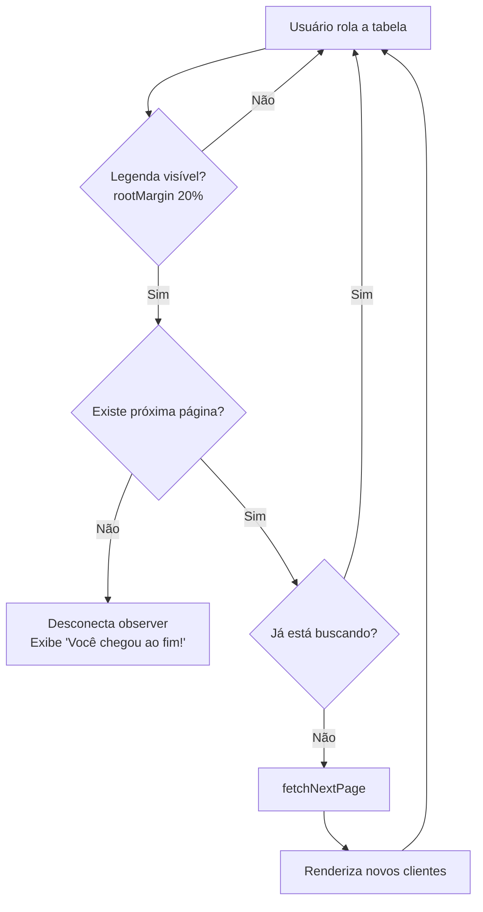
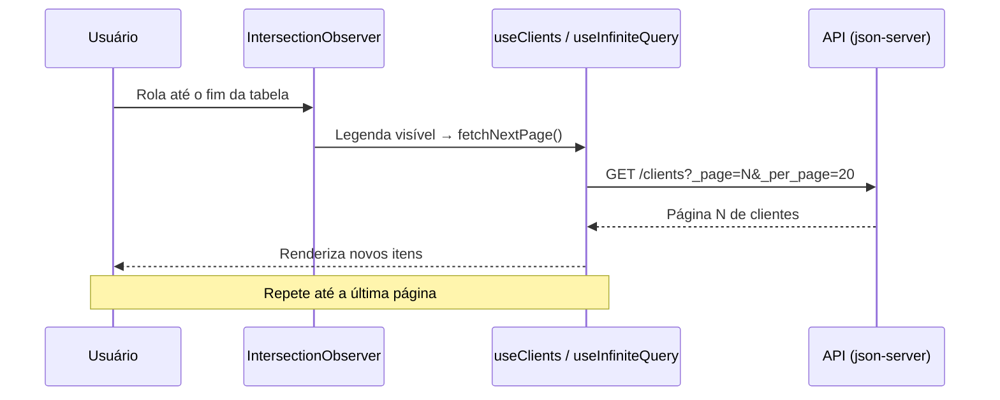

# Paginação e Scroll Infinito

Listagem de clientes com **paginação** evoluída para **scroll infinito** (infinite scroll), construída com React 19 e TanStack Query. Conforme o usuário rola a tabela, novas páginas são buscadas automaticamente através de um `IntersectionObserver`, com _prefetch_ antecipado e feedback visual de carregamento e fim da lista.

## Funcionalidades

| Recurso | Descrição |
| ------- | --------- |
| 📜 Scroll infinito | Carregamento paginado contínuo via `useInfiniteQuery` do TanStack Query |
| 👀 Detecção de rolagem | `IntersectionObserver` observa a legenda da tabela para disparar a próxima página |
| ⚡ Prefetch antecipado | `rootMargin: '20%'` carrega a próxima página antes de chegar ao fim |
| 🚫 Sem buscas duplicadas | Evita disparar novas requisições enquanto uma página já está carregando |
| 🏁 Fim da lista | Para de buscar e exibe mensagem quando a última página é atingida |
| 💀 Skeleton loading | Feedback visual durante o carregamento inicial |

## Tecnologias

| Tecnologia | Uso |
| ---------- | --- |
| [React 19](https://react.dev/) + [React Compiler](https://react.dev/learn/react-compiler) | Interface e otimização automática |
| [Vite](https://vite.dev/) | Build e servidor de desenvolvimento |
| [TypeScript](https://www.typescriptlang.org/) | Tipagem estática |
| [TanStack Query](https://tanstack.com/query) | Data fetching com `useInfiniteQuery` |
| [Axios](https://axios-http.com/) | Cliente HTTP |
| [Tailwind CSS v4](https://tailwindcss.com/) + [shadcn/ui](https://ui.shadcn.com/) | Estilização e componentes de UI |
| [json-server](https://github.com/typicode/json-server) | API mock |
| [Biome](https://biomejs.dev/) | Lint e formatação |
| [Husky](https://typicode.github.io/husky/) + [Commitlint](https://commitlint.js.org/) | Commits padronizados (gitmoji) |

## Como funciona o scroll infinito

1. O hook `useClients` usa `useInfiniteQuery` para buscar clientes página a página (`getNextPageParam` calcula se ainda há próxima página).
2. Um `IntersectionObserver` observa a `<TableCaption>` no fim da tabela.
3. Quando a legenda entra na área visível (com margem de 20% para _prefetch_), `fetchNextPage` é chamado — desde que exista próxima página e nenhuma outra requisição esteja em andamento.
4. Ao atingir a última página, o observer é desconectado e a mensagem "Você chegou ao fim!" é exibida.

### Fluxo de decisão

### Ciclo de requisição

---

Projeto desenvolvido como parte do curso do JStack.
